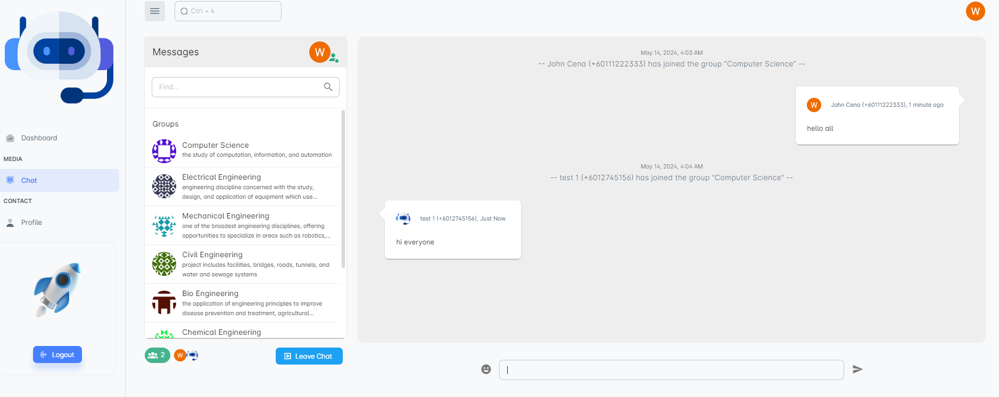

# About
Chat server application built using the MEN stack in mind. To serve as a boiler plate for chat service projects.

## Prerequisites
- NPM v10.5 +
- Node v20.10 +
- Ubuntu 20.04.4 LTS (Focal Fossa)
- PM2 v5 +

## Tested on
- NPM v10.5.2
- Node v20.10.0
- Ubuntu 20.04.4 LTS (Focal Fossa)
- PM2 v5.3.1

## Features
* Real Time Messaging Service
* Google SSO Authentication
* Wiki API support
* API Auth support
* Web Socket support
* Redis rate limiting support
* Redis cache support
* PM2 & Nginx load balancing support 

##  Sample using Vue (PM for demo)

 
 

## Get Started:

### NPM Execution
1. Configure env variables
2. (Optional) For database seeding, adjust manually at src/services/seederService.ts according to your preference
3. cli: npm run build
4. cli: npm run start

### PM2 Execution:
1. Configure env variables
2. (Optional) For database seeding, adjust manually at src/services/seederService.ts according to your preference
3. cli: npm run pm2

